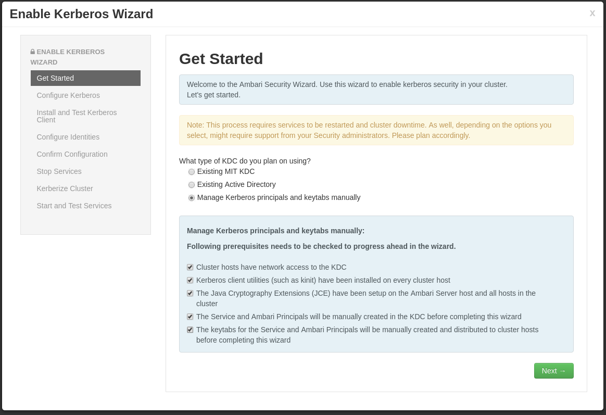
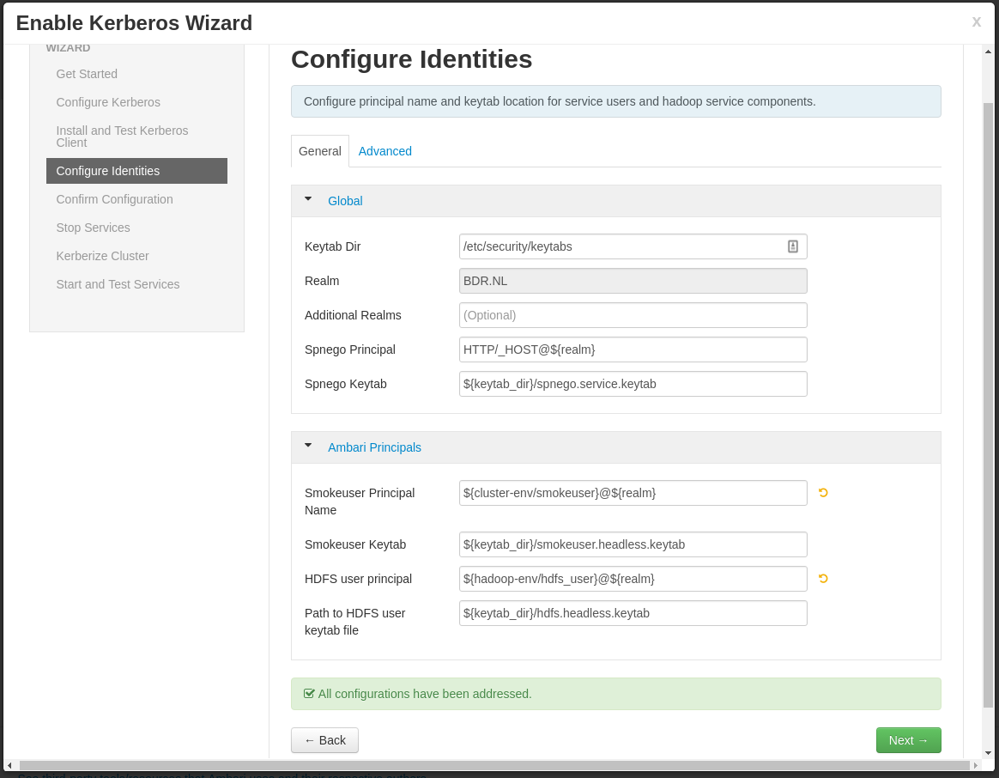
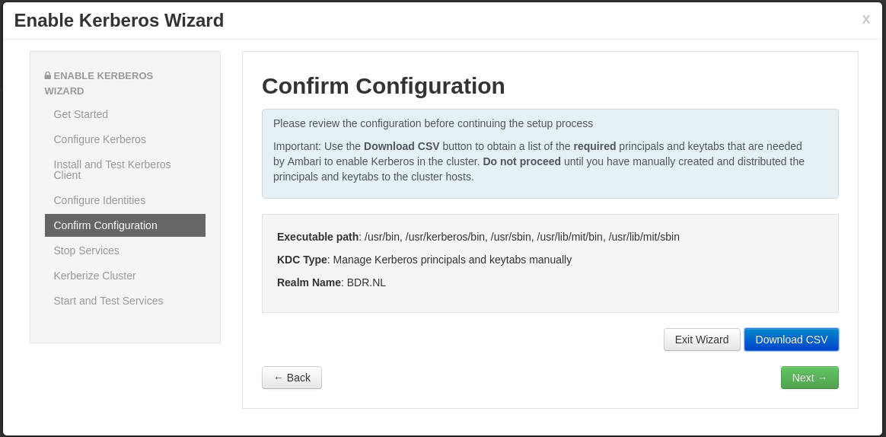

# Configure Ambari and Hadoop for Kerberos

For complete documentation on Kerberizing an Ambari managed cluster take a look
[here](https://docs.hortonworks.com/HDPDocuments/Ambari-2.2.1.1/bk_Ambari_Security_Guide/content/_kerberos_overview.html)

1. Go to the Ambari web interface

    * Admin -> Kerberos
    * Click 'Enable Kerberos'

1. Kerberos wizard - Get started

   

1. Kerberos wizard - Configure kerberos

    

1. Kerberos wizard - Configure Identities

   * Remove clustername from smoke/hdfs principals to remove the -${cluster_name} references to look like below

   

1. Kerberos wizard - Confirm Configuration

   Download csv file but **DO NOT** click Next yet

   

# Configure hosts


1. Copy the kerberos csv file to the ipa host

1. Login on the ipa host
```
    $ vagrant ssh ipa.bdr.nl
    vagrant@ipa $ sudo su -
    root@ipa $
```

1. On the ipa host, create principals, using the csv file.
```
    root@ipa $ awk -F"," '/SERVICE/ {print "ipa service-add --force "$3}' kerberos.csv | sort -u > ipa-add-spn.sh
    root@ipa $ awk -F"," '/USER/ {print "ipa user-add "$5" --first="$5" --last=Hadoop --shell=/sbin/nologin"}' kerberos.csv | sort -u > ipa-add-upn.sh

    root@ipa $ sh ipa-add-spn.sh
    root@ipa $ sh ipa-add-upn.sh
```

## Create keytabs on nodes (mgmt1, en1, mn1, wn1)

First you have to retrieve an kerberos ticket.

```
    root@mgmt1 $ kinit admin
```
Next, retrieve keytabs for users/services on this host from the ipa server.
```
    root@mgmt1 $ ipa_server=$(cat /etc/ipa/default.conf | awk '/^server =/ {print $3}')
    root@mgmt1 $ mkdir /etc/security/keytabs/
    root@mgmt1 $ chown root:hadoop /etc/security/keytabs/
    root@mgmt1 $ awk -F"," '/'$(hostname -f)'/ {print "ipa-getkeytab -s '${ipa_server}' -p "$3" -k "$6";chown "$7":"$9,$6";chmod "$11,$6}' kerberos.csv | sort -u > gen_keytabs.sh
    root@mgmt1 $ bash ./gen_keytabs.sh
```
Make sure that keytabs were generated succesfully (**NOTE:** adjust lines below
to reflect users and/or services that actually run on the host):
```
    root@mgmt1 $ sudo -u ambari-qa kinit -kt /etc/security/keytabs/smokeuser.headless.keytab ambari-qa@BDR.NL
    root@mgmt1 $ sudo -u hdfs kinit -kt /etc/security/keytabs/hdfs.headless.keytab hdfs@BDR.NL
```

**NOTE:** Repeat above process for *all* nodes part of your cluster.


1. In Ambari Web, select Admin -> Kerberos
1. Click enable Kerberos
1. Read the warning and make sure it has no consequences for you setup. This is
   why you typically perform this step as early as possible.
1. Click proceed anyway
1. Get started

    * Select: Existing MIT KDC
    * Check the three boxes below if you have verified all information
1. Configure Kerberos

    * KDC host: ipa.bdr.nl
    * Realm name: BDR.NL
    * Domains: bdr.nl

    Click: Test KDC connection -> should return "Connection OK"

    * Kadmin host: ipa.bdr.nl
    * Admin principal: admin@BDR.NL
    * Admin password: bdr-ipa-admin
    * Click next

1. Install

1. Kerberize cluster
    1. Setup dedicated kerberos server ([info](https://docs.hortonworks.com/HDPDocuments/HDP2/HDP-2.4.0/bk_Security_Guide/content/_optional_install_a_new_mit_kdc.html))
```
    $ yum install krb5-server krb5-libs krb5-workstation
    $ vim /etc/krb5.conf
```
```
    [logging]
    default = FILE:/var/log/krb5libs.log
    kdc = FILE:/var/log/krb5kdc.log
    admin_server = FILE:/var/log/kadmind.log

    [libdefaults]
    default_realm = HDP.BDR.NL
    dns_lookup_realm = false
    dns_lookup_kdc = false
    ticket_lifetime = 24h
    renew_lifetime = 7d
    forwardable = true

    [realms]
    HDP.BDR.NL = {
      kdc = mgmt1.bdr.nl
      admin_server = mgmt1.bdr.nl
    }

    [domain_realm]
    .hdp.bdr.nl = HDP.BDR.NL
    hdp.bdr.nl = HDP.BDR.NL
```
    1. Create an admin user and make sure that kerberos is starter on
       boot.
```
    $ kdb5_util create -s [Pass: kerberos.bdr.nl]
    $ chkconfig krb5kdc on
    $ chkconfig kadmin on
    $ service krb5kdc start
    $ service kadmin start
    $ kadmin.local -q "addprinc admin/admin" [Pass: admin]
    $ vim /var/kerberos/krb5kdc/kadm5.acl
```
    1. Make sure that the REALM part is set to HDP.BDR.NL
```
    $ service kadmin restart
```
