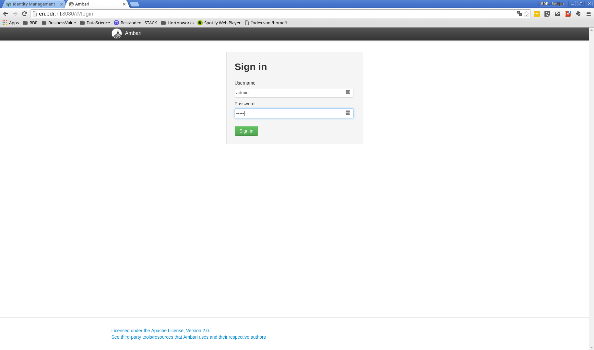
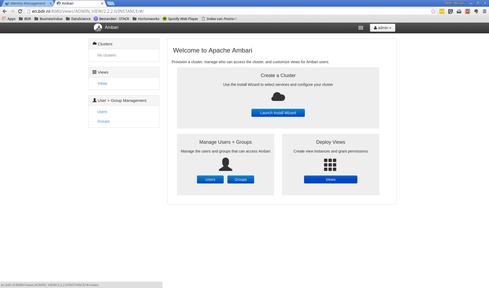

# Ambari server preparation

> The Apache Ambari project is aimed at making Hadoop management simpler by developing software for provisioning, managing, and monitoring Apache Hadoop clusters. Ambari provides an intuitive, easy-to-use Hadoop management web UI backed by its RESTful APIs.
>
> -- <cite>[https://ambari.apache.org/](https://ambari.apache.org/)</cite>

**Goal:** Prepare the edge node for an Ambari managed setup of the Hadoop Data Platform (HDP). Make sure an ambari user is created in FreeIPA. Make sure a custom database is prepared for edge node services which require a database.

**Rationale:** [Ambari](https://ambari.apache.org/) is a convenient way to install and monitor a cluster. When relying on system users, the ambari user, with proper sudo rights, must be created on each host in the cluster. On large installs this is undesirable. FreeIPA allows us to create one ambari user, with proper rights, which is available on each host registered in FreeIPA. Without additional configuration it will install multiple database for the tools that require a relational database. From a maintenance point of view, this is undesireable. Therefore we'll setup the cluster to make use of the same database system. In this tutorial we use PostgreSQL.

Ambari consists of two main components: Ambari server and Ambari agent. Ambari server collects informations from all Ambari clients and sends operations to clients (start/stop/restart a service, change configuration for a service, etc.). Ambari client sends informations about machine and services installed on this machine. There is one Ambari server in a cluster and one Ambari agent per machine in the cluster. A detailed overview of Ambari's architecture is explained [here (PDF)](https://issues.apache.org/jira/secure/attachment/12559939/Ambari_Architecture.pdf).

# Enter the Edge node

Ambari will run on the edge node. Therefore, we'll need to ssh into the proper virtual machine.

```
you@yourhost $ cd /path/to/tutorialdir/vms
you@yourhost $ vagrant up
you@yourhost $ vagrant ssh en
vagrant@gw.bdr.nl $ sudo su -
root@en.bdr.nl $
```

## Install ambari-server

Install ambari-server. PostgreSQL will be installed as well as it is a dependency.

```
root@en.bdr.nl $ yum install wget
root@en.bdr.nl $ wget -nv http://public-repo-1.hortonworks.com/ambari/centos7/2.x/updates/2.4.0.1/ambari.repo -O /etc/yum.repos.d/ambari.repo
root@en.bdr.nl $ yum install ambari-server
....
Retrieving key from http://public-repo-1.hortonworks.com/ambari/centos7/RPM-GPG-KEY/RPM-GPG-KEY-Jenkins
Importing GPG key 0x07513CAD:
 Userid     : "Jenkins (HDP Builds) <jenkin@hortonworks.com>"
 Fingerprint: df52 ed4f 7a3a 5882 c099 4c66 b973 3a7a 0751 3cad
 From       : http://public-repo-1.hortonworks.com/ambari/centos7/RPM-GPG-KEY/RPM-GPG-KEY-Jenkins
Is this ok [y/N]: y
....
```

# Configure PostgreSQL

We will manually manage the PostgreSQL configuration. This way we can reuse the same PostgreSQL instance for all services wich require a relational database.

```
root@en.bdr.nl $ service postgresql initdb
root@en.bdr.nl $ chkconfig postgresql on
Note: Forwarding request to 'systemctl enable postgresql.service'.
Created symlink from /etc/systemd/system/multi-user.target.wants/postgresql.service to /usr/lib/systemd/system/postgresql.service.
root@en.bdr.nl $ systemctl start postgresql
root@en.bdr.nl $ su - postgres
postgres@en.bdr.nl $ mv data/pg_hba.conf data/pg_hba.conf.bak
postgres@en.bdr.nl $ vi data/pg_hba.conf

```

Replace the content of the file with the following two lines:

```
# TYPE  DATABASE        USER            ADDRESS                 METHOD
local   all             postgres                                peer
host    ambaridb        ambari          10.0.0.3/32             md5
```

What does this do: It allows only unix socket connections for user postgres. And the ambari user can only connect over a tcp connection and may only acccess de ambaridb database.


Configure postgresql to listen for tcp connections.

```
postgres@en.bdr.nl $ vi data/postgresql.conf
```

Uncomment the following line and change the value:

```
listen_addresses = '10.0.0.3'
```

Next, we have to restart the PostgreSQL server:

```
postgres@en.bdr.nl $ exit
root@en.bdr.nl $ systemctl restart postgresql
```

Create the required database:

```
root@en.bdr.nl $ sudo -u postgres psql
psql (9.2.15)
Type "help" for help.

postgres=# CREATE DATABASE ambaridb;
postgres=# CREATE USER ambari WITH PASSWORD 'ambari';
postgres=# GRANT ALL PRIVILEGES ON DATABASE ambaridb TO ambari;
postgres=# \connect ambaridb;
ambaridb=# CREATE SCHEMA ambari AUTHORIZATION ambari;
ambaridb=# ALTER SCHEMA ambari OWNER TO ambari;
ambaridb=# ALTER ROLE ambari SET search_path to ‘ambari’, 'public';
postgres=# CREATE DATABASE hivedb;
postgres=# CREATE USER hive WITH PASSWORD 'hive';
postgres=# GRANT ALL PRIVILEGES ON DATABASE hivedb TO hive;
ambaridb=# \q
```


Create the required tables:

```
root@en.bdr.nl $ # psql -U ambari -d ambaridb -a -f /var/lib/ambari-server/resources/Ambari-DDL-Postgres-CREATE.sql -h 10.0.0.3
Password for user ambari: ambari<enter>
```

## Install and configure PostgreSQL jdbc driver

```
root@en.bdr.nl $ yum install postgresql-jdbc
root@en.bdr.nl $ ambari-server setup --jdbc-db=postgres --jdbc-driver=/usr/share/java/postgresql-jdbc.jar
Using python  /usr/bin/python
Setup ambari-server
Copying /usr/share/java/postgresql-jdbc.jar to /var/lib/ambari-server/resources
JDBC driver was successfully initialized.
Ambari Server 'setup' completed successfully.
```

## Configure and start ambari-server

```
root@en.bdr.nl $ ambari-server setup
Using python  /usr/bin/python
Setup ambari-server
Checking SELinux...
SELinux status is 'disabled'
Customize user account for ambari-server daemon [y/n] (n)? y
Enter user account for ambari-server daemon (root):ambari
Adjusting ambari-server permissions and ownership...
Checking firewall status...
Redirecting to /bin/systemctl status  iptables.service

Checking JDK...
[1] Oracle JDK 1.8 + Java Cryptography Extension (JCE) Policy Files 8
[2] Oracle JDK 1.7 + Java Cryptography Extension (JCE) Policy Files 7
[3] Custom JDK
==============================================================================
Enter choice (1): 3
WARNING: JDK must be installed on all hosts and JAVA_HOME must be valid on all hosts.
WARNING: JCE Policy files are required for configuring Kerberos security. If you plan to use Kerberos,please make sure JCE Unlimited Strength Jurisdiction Policy Files are valid on all hosts.
Path to JAVA_HOME: /usr/lib/jvm/jre-1.8.0-openjdk
Validating JDK on Ambari Server...done.
Completing setup...
Configuring database...
Enter advanced database configuration [y/n] (n)? y
Configuring database...
==============================================================================
Choose one of the following options:
[1] - PostgreSQL (Embedded)
[2] - Oracle
[3] - MySQL
[4] - PostgreSQL
[5] - Microsoft SQL Server (Tech Preview)
[6] - SQL Anywhere
==============================================================================
Enter choice (1): 4
Hostname (localhost): en.bdr.nl
Port (5432):
Database name (ambari): ambaridb
Postgres schema (ambari):
Username (ambari):
Enter Database Password (bigdata):
Re-enter password:
Configuring ambari database...
Configuring remote database connection properties...
WARNING: Before starting Ambari Server, you must run the following DDL against the database to create the schema: /var/lib/ambari-server/resources/Ambari-DDL-Postgres-CREATE.sql
Proceed with configuring remote database connection properties [y/n] (y)? y
Extracting system views...
ambari-admin-2.2.2.0.460.jar
......
Adjusting ambari-server permissions and ownership...
Ambari Server 'setup' completed successfully.
```

If everything went well, you can now start ambari

```
root@en.bdr.nl $ ambari-server start
Using python  /usr/bin/python
Starting ambari-server
Ambari Server running with administrator privileges.
Organizing resource files at /var/lib/ambari-server/resources...
Server PID at: /var/run/ambari-server/ambari-server.pid
Server out at: /var/log/ambari-server/ambari-server.out
Server log at: /var/log/ambari-server/ambari-server.log
Waiting for server start....................
Ambari Server 'start' completed successfully.

```

Point your browser to [http://10.0.0.3:8080](http://10.0.0.3:8080). You should see the Ambari management webinterface. Log in with user admin, password admin.



After a succesful login you now have access to the ambari management interface.


