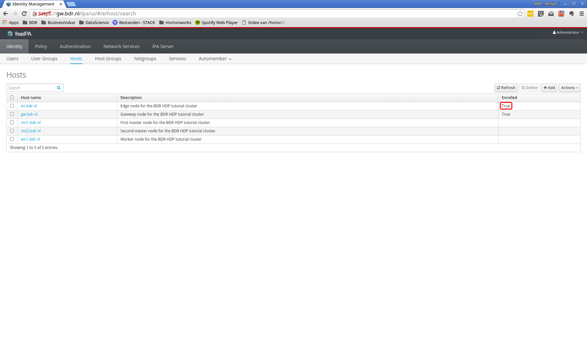
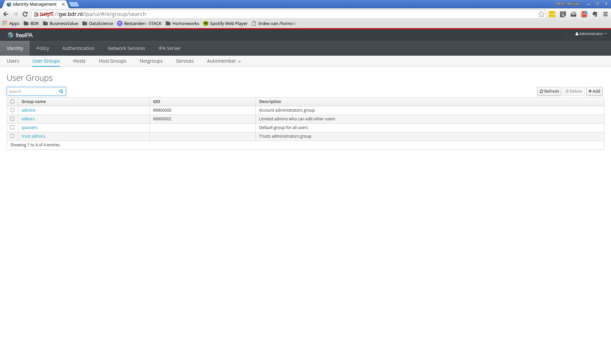
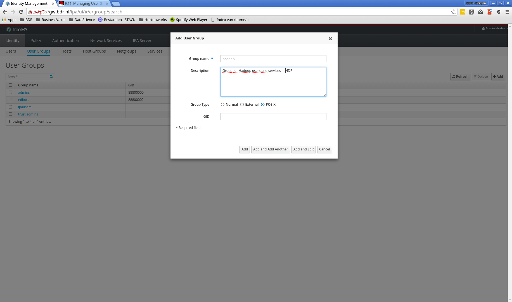
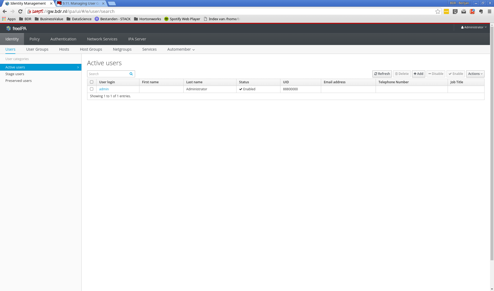
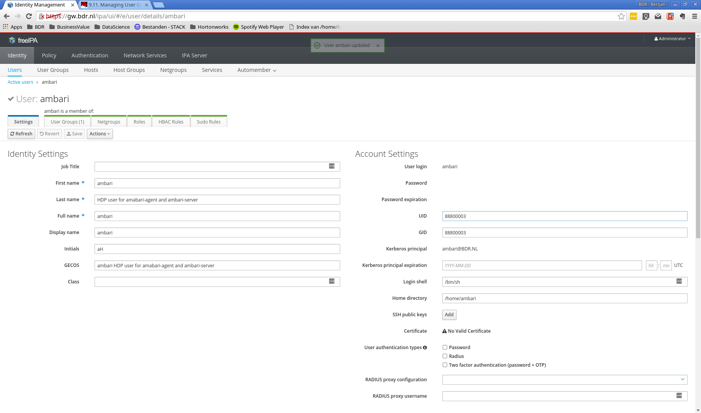
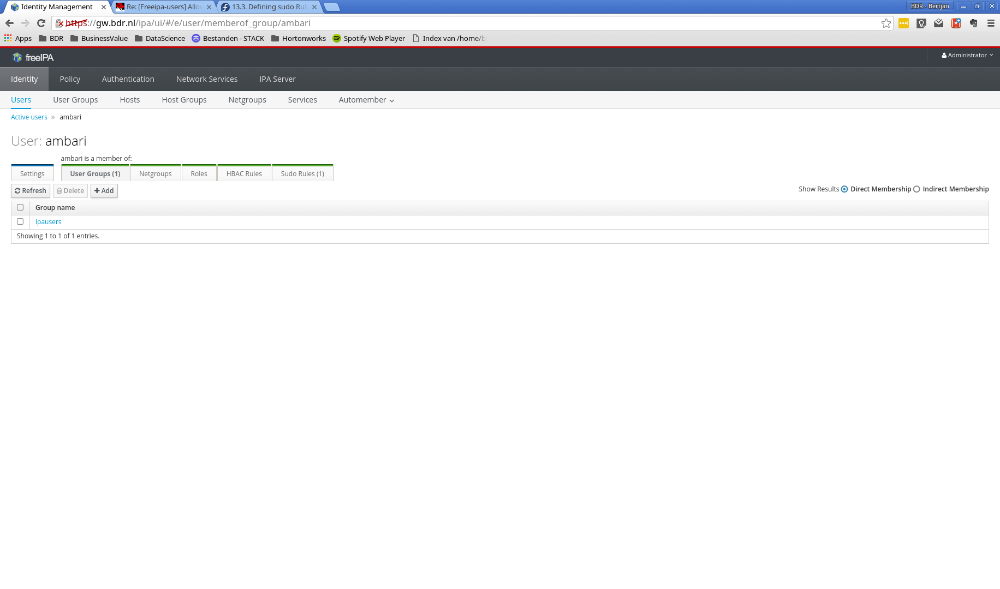
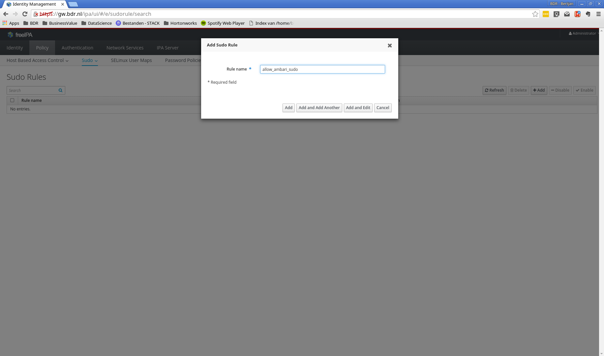
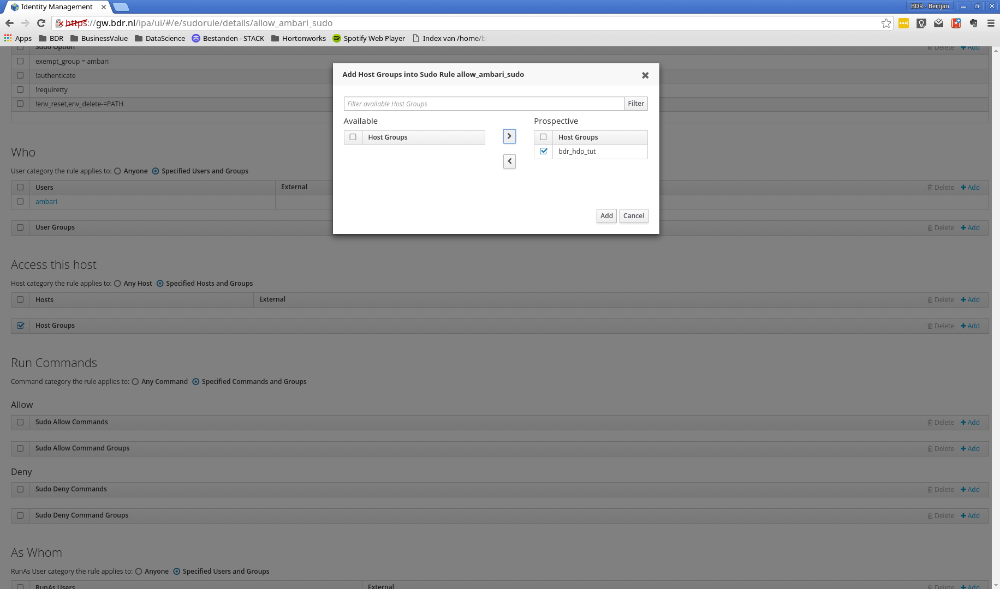
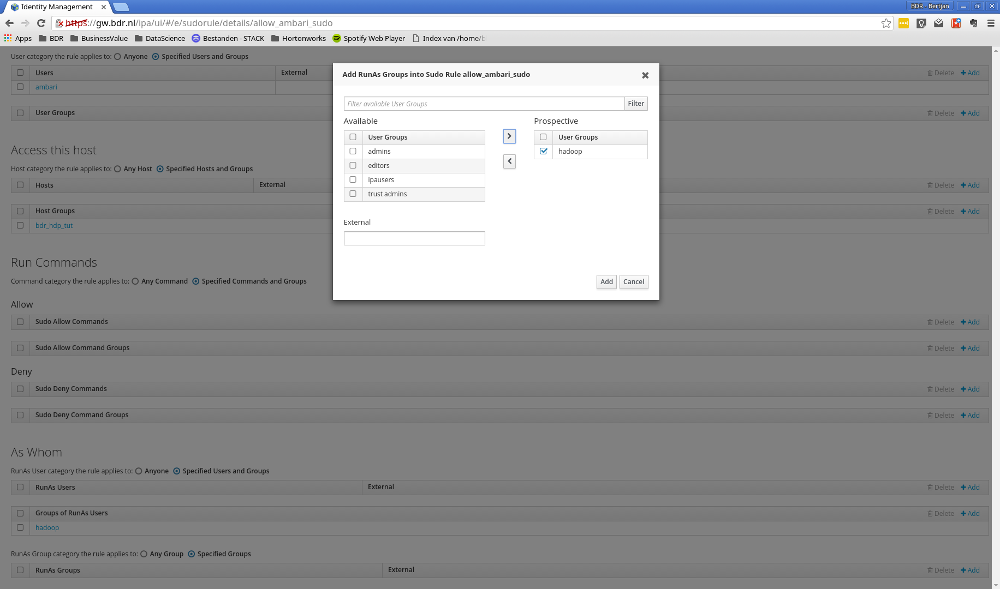
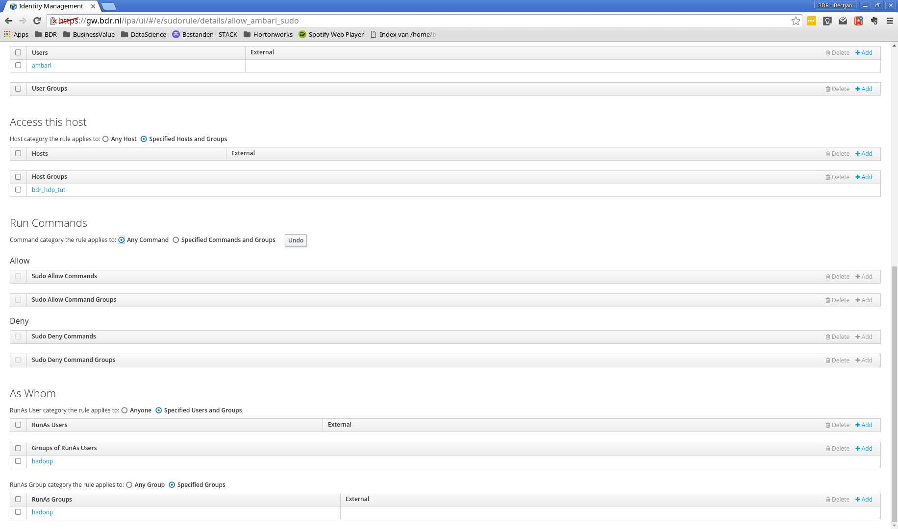

# Ambari server preparation

> The Apache Ambari project is aimed at making Hadoop management simpler by developing software for provisioning, managing, and monitoring Apache Hadoop clusters. Ambari provides an intuitive, easy-to-use Hadoop management web UI backed by its RESTful APIs.
>
> -- <cite>[https://ambari.apache.org/](https://ambari.apache.org/)</cite>

**Goal:** Prepare the edge node for an Ambari managed setup of the Hadoop Data Platform (HDP). Make sure an ambari user is created in FreeIPA. Make sure a custom database is prepared for edge node services which require a database.

**Rationale:** [Ambari](https://ambari.apache.org/) is a convenient way to install and monitor a cluster. When relying on system users, the ambari user, with proper sudo rights, must be created on each host in the cluster. On large installs this is undesirable. FreeIPA allows us to create one ambari user, with proper rights, which is available on each host registered in FreeIPA. Without additional configuration it will install multiple database for the tools that require a relational database. From a maintenance point of view, this is undesireable. Therefore we'll setup the cluster to make use of the same database system. In this tutorial we use PostgreSQL.

Ambari consists of two main components: Ambari server and Ambari agent. Ambari server collects informations from all Ambari clients and sends operations to clients (start/stop/restart a service, change configuration for a service, etc.). Ambari client sends informations about machine and services installed on this machine. There is one Ambari server in a cluster and one Ambari agent per machine in the cluster. A detailed overview of Ambari's architecture is explained [here (PDF)](https://issues.apache.org/jira/secure/attachment/12559939/Ambari_Architecture.pdf).

# Enter the Edge node

Ambari will run on the edge node. Therefore, we'll need to ssh into the proper virtual machine.

```
you@yourhost $ cd /path/to/tutorialdir/vms
you@yourhost $ vagrant up
you@yourhost $ vagrant ssh en
vagrant@gw.bdr.nl $ sudo su -
root@en.bdr.nl $
```

# Register the host to FreeIPA

The first step is to register the host to FreeIPA. We need to install the ipa-client and perform the ipa-client-install as detailed below.

```
root@en.bdr.nl $ yum install -y ipa-client
root@en.bdr.nl $ ipa-client-install
DNS discovery failed to determine your DNS domain
Provide the domain name of your IPA server (ex: example.com): bdr.nl
Provide your IPA server name (ex: ipa.example.com): gw.bdr.nl
The failure to use DNS to find your IPA server indicates that your resolv.conf file is not properly configured.
Autodiscovery of servers for failover cannot work with this configuration.
If you proceed with the installation, services will be configured to always access the discovered server for all operations and will not fail over to other servers in case of failure.
Proceed with fixed values and no DNS discovery? [no]: yes
Client hostname: en.bdr.nl
Realm: BDR.NL
DNS Domain: bdr.nl
IPA Server: gw.bdr.nl
BaseDN: dc=bdr,dc=nl

Continue to configure the system with these values? [no]: yes
Synchronizing time with KDC...
Attempting to sync time using ntpd.  Will timeout after 15 seconds
User authorized to enroll computers: admin
Password for admin@BDR.NL:
Successfully retrieved CA cert
    Subject:     CN=Certificate Authority,O=BDR.NL
    Issuer:      CN=Certificate Authority,O=BDR.NL
    Valid From:  Fri Jul 01 20:15:36 2016 UTC
    Valid Until: Tue Jul 01 20:15:36 2036 UTC

Enrolled in IPA realm BDR.NL
Created /etc/ipa/default.conf
New SSSD config will be created
Configured sudoers in /etc/nsswitch.conf
Configured /etc/sssd/sssd.conf
Configured /etc/krb5.conf for IPA realm BDR.NL
trying https://gw.bdr.nl/ipa/json
Forwarding 'ping' to json server 'https://gw.bdr.nl/ipa/json'
Forwarding 'ca_is_enabled' to json server 'https://gw.bdr.nl/ipa/json'
Systemwide CA database updated.
Added CA certificates to the default NSS database.
Hostname (en.bdr.nl) does not have A/AAAA record.
Failed to update DNS records.
Missing A/AAAA record(s) for host en.bdr.nl: 10.0.0.3.
Missing reverse record(s) for address(es): 10.0.0.3.
Adding SSH public key from /etc/ssh/ssh_host_rsa_key.pub
Adding SSH public key from /etc/ssh/ssh_host_ecdsa_key.pub
Adding SSH public key from /etc/ssh/ssh_host_ed25519_key.pub
Forwarding 'host_mod' to json server 'https://gw.bdr.nl/ipa/json'
Could not update DNS SSHFP records.
SSSD enabled
Configured /etc/openldap/ldap.conf
No SRV records of NTP servers found. IPA server address will be used
NTP enabled
Configured /etc/ssh/ssh_config
Configured /etc/ssh/sshd_config
Configuring bdr.nl as NIS domain.
Client configuration complete.

```

Once the setup is completed, FreeIPA now should mark the Edge Node as enrolled (you might need to refresh the page):




# Create a user for Ambari

By default ambari-server and ambari-agents run as root. This is not best practice so we will create a dedicated user, called ambari, under which these services will run. As we use FreeIPA, we can create the ambari user there, and it will become available on all nodes, once each of them has been enrolled to FreeIPA.

## Create the hadoop users group

The ambari user must be in the hadoop group<sup>[*](https://docs.hortonworks.com/HDPDocuments/Ambari-2.2.1.1/bk_Ambari_Security_Guide/content/_how_to_configure_ambari_server_for_non-root.html)</sup>. Let's add a group hadoop first. Go to the FreeIPA webinterface and click the 'User Groups' tab under 'Identity'.



Click add group to create a new group. The group name **must** be hadoop and the group type **must** be posix, as this group will serve as a linux user group on our cluster nodes.



Click add, and the group should now appear in the group list.


## Create the ambari user




Click add and edit:



Make sure that the following details are correct:


### Settings

* login shell: /bin/bash

### User Groups

* Add the earlier create hadoop group




## Create a sudoers rule

The ambari user relies on sudo to run specific commands that require elevated privileges. Therefore we must create a proper sudo rule for the ambari user ([details](https://docs.hortonworks.com/HDPDocuments/Ambari-2.2.1.1/bk_Ambari_Security_Guide/content/_configuring_ambari_for_non-root.html)).












## Check if everything works

Once you have created the hadoop group, ambari user, and the appropriate sudo configuration, you will restart the sssd service on en.bdr.nl:

```
root@en.bdr.nl $ service sssd restart
root@en.bdr.nl $ sudo su - ambari
# sudo su - ambari
Last login: Fri Jul  1 17:28:55 PDT 2016 on pts/0
su: warning: cannot change directory to /home/ambari: No such file or directory
ambari@en.bdr.nl $
```

The warning can be fixed by creating a home directory for ambari. This is not strictly required, but is done as follows:

```
ambari@en.bdr.nl $ exit
root@en.bdr.nl $ mkdir /home/ambari
root@en.bdr.nl $ chown -R ambari:ambari /home/ambari
root@en.bdr.nl $ sudo - su ambari
Last login: Fri Jul  1 17:34:04 PDT 2016 on pts/0
ambari@en.bdr.nl $
```

Let's check our sudo rights:

```
ambari@en.bdr.nl $ sudo -l
Matching Defaults entries for ambari on this host:
    !visiblepw, always_set_home, env_reset, env_keep="COLORS DISPLAY HOSTNAME HISTSIZE INPUTRC KDEDIR LS_COLORS", env_keep+="MAIL PS1 PS2 QTDIR USERNAME LANG LC_ADDRESS LC_CTYPE", env_keep+="LC_COLLATE LC_IDENTIFICATION
    LC_MEASUREMENT LC_MESSAGES", env_keep+="LC_MONETARY LC_NAME LC_NUMERIC LC_PAPER LC_TELEPHONE", env_keep+="LC_TIME LC_ALL LANGUAGE LINGUAS _XKB_CHARSET XAUTHORITY", secure_path=/sbin\:/bin\:/usr/sbin\:/usr/bin

User ambari may run the following commands on this host:
    (ALL : ALL) NOPASSWD: ALL
ambari@en.bdr.nl $ sudo su -
root@en.bdr.nl $
```

## Install ambari-server

Install ambari-server. PostgreSQL will be installed as well as it is a dependency.

```
root@en.bdr.nl $ wget -nv http://public-repo-1.hortonworks.com/ambari/centos7/2.x/updates/2.2.2.0/ambari.repo -O /etc/yum.repos.d/ambari.repo
root@en.bdr.nl $ yum install ambari-server
....
Retrieving key from http://public-repo-1.hortonworks.com/ambari/centos7/RPM-GPG-KEY/RPM-GPG-KEY-Jenkins
Importing GPG key 0x07513CAD:
 Userid     : "Jenkins (HDP Builds) <jenkin@hortonworks.com>"
 Fingerprint: df52 ed4f 7a3a 5882 c099 4c66 b973 3a7a 0751 3cad
 From       : http://public-repo-1.hortonworks.com/ambari/centos7/RPM-GPG-KEY/RPM-GPG-KEY-Jenkins
Is this ok [y/N]: y
....
```

# Configure PostgreSQL

We will manually manage the PostgreSQL configuration. This way we can reuse the same PostgreSQL instance for all services wich require a relational database.

```
root@en.bdr.nl $ service postgresql initdb
root@en.bdr.nl $ chkconfig postgresql on
Note: Forwarding request to 'systemctl enable postgresql.service'.
Created symlink from /etc/systemd/system/multi-user.target.wants/postgresql.service to /usr/lib/systemd/system/postgresql.service.
root@en.bdr.nl $ systemctl start postgresql
root@en.bdr.nl $ su - postgres
postgres@en.bdr.nl $ vi data/pg_hba.conf

```

Replace the content of the file with the following two lines:

```
# TYPE  DATABASE        USER            ADDRESS                 METHOD
local   all             postgres                                peer
host    ambaridb        ambari          10.0.0.3/32             md5
```

What does this do: It allows only unix socket connections for user postgres. And the ambari user can only connect over a tcp connection and may only acccess de ambaridb database.


Configure postgresql to listen for tcp connections.

```
postgres@en.bdr.nl $ vi data/postgresql.conf
```

Uncomment the following line and change the value:

```
listen_addresses = '10.0.0.3'
```

Next, we have to restart the PostgreSQL server:

```
postgres@en.bdr.nl $ exit
root@en.bdr.nl $ systemctl restart postgres
```

Create the required tables:

```
root@en.bdr.nl $ # psql -U ambari -d ambaridb -a -f /var/lib/ambari-server/resources/Ambari-DDL-Postgres-CREATE.sql -h 10.0.0.3
Password for user ambari: ambari<enter>
```

## Install and configure PostgreSQL jdbc driver

```
root@en.bdr.nl $ yum install postgresql-jdbc
root@en.bdr.nl $ ambari-server setup --jdbc-db=postgres --jdbc-driver=/usr/share/java/postgresql-jdbc.jar
Using python  /usr/bin/python
Setup ambari-server
Copying /usr/share/java/postgresql-jdbc.jar to /var/lib/ambari-server/resources
JDBC driver was successfully initialized.
Ambari Server 'setup' completed successfully.
```

## Configure and start ambari-server

```
root@en.bdr.nl $ ambari-server setup
Using python  /usr/bin/python
Setup ambari-server
Checking SELinux...
SELinux status is 'disabled'
Customize user account for ambari-server daemon [y/n] (n)? y
Enter user account for ambari-server daemon (root):ambari
Adjusting ambari-server permissions and ownership...
Checking firewall status...
Redirecting to /bin/systemctl status  iptables.service

Checking JDK...
[1] Oracle JDK 1.8 + Java Cryptography Extension (JCE) Policy Files 8
[2] Oracle JDK 1.7 + Java Cryptography Extension (JCE) Policy Files 7
[3] Custom JDK
==============================================================================
Enter choice (1): 3
WARNING: JDK must be installed on all hosts and JAVA_HOME must be valid on all hosts.
WARNING: JCE Policy files are required for configuring Kerberos security. If you plan to use Kerberos,please make sure JCE Unlimited Strength Jurisdiction Policy Files are valid on all hosts.
Path to JAVA_HOME: /usr/lib/jvm/java-1.8.0-openjdk-1.8.0.91-1.b14.el7_2.x86_64/jre
Validating JDK on Ambari Server...done.
Completing setup...
Configuring database...
Enter advanced database configuration [y/n] (n)? y
Configuring database...
==============================================================================
Choose one of the following options:
[1] - PostgreSQL (Embedded)
[2] - Oracle
[3] - MySQL
[4] - PostgreSQL
[5] - Microsoft SQL Server (Tech Preview)
[6] - SQL Anywhere
==============================================================================
Enter choice (1): 4
Hostname (localhost): en.bdr.nl
Port (5432):
Database name (ambari): ambaridb
Postgres schema (ambari):
Username (ambari):
Enter Database Password (bigdata):
Re-enter password:
Configuring ambari database...
Configuring remote database connection properties...
WARNING: Before starting Ambari Server, you must run the following DDL against the database to create the schema: /var/lib/ambari-server/resources/Ambari-DDL-Postgres-CREATE.sql
Proceed with configuring remote database connection properties [y/n] (y)? y
Extracting system views...
ambari-admin-2.2.2.0.460.jar
......
Adjusting ambari-server permissions and ownership...
Ambari Server 'setup' completed successfully.
```

If everything went well, you can now start ambari

```
root@en.bdr.nl $ ambari-server start
Using python  /usr/bin/python
Starting ambari-server
Ambari Server running with administrator privileges.
Organizing resource files at /var/lib/ambari-server/resources...
Server PID at: /var/run/ambari-server/ambari-server.pid
Server out at: /var/log/ambari-server/ambari-server.out
Server log at: /var/log/ambari-server/ambari-server.log
Waiting for server start....................
Ambari Server 'start' completed successfully.

```

Point your browser to 10.0.0.3:8080. You should see the Ambari management webinterface. Log in with user admin, password admin.


After a succesful login you now have access to the ambari management interface.


