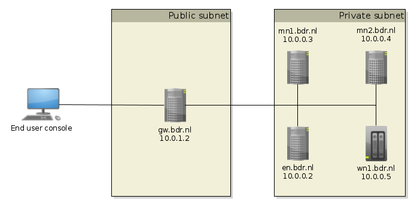
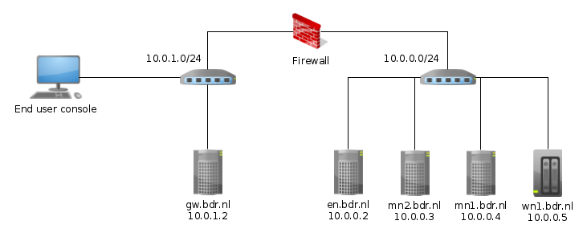

# Design considerations

The goal is to setup a cluster with five nodes, which to some extent resembles a real cluster. In HDP we distinguish between three types of nodes:

1. Hadoop cluster nodes (master, storage, and compute nodes)
1. Edge nodes (end user functionality)
1. Gateway node (proxy and authentication)

We will setup a gateway node which runs FreeIPA and Apache Knox. FreeIPA is a centralized enterprise user management system which also provides Kerberos authentication. Apache Knox is a proxy server, which integrates with both FreeIPA and HDP. It hides the structure of the cluster for end users, and enforces authentication.

Edge nodes provide the actual end-user functionality. This end-user functionality consists of management functionality (e.g. managing the cluster, setting user right, monitoring) and analytical functionality (e.g. WebHDFS, Zeppelin). End user functionality can be both for human users (through web interfaces) as for applications (through REST APIs)

The Hadoop cluster nodes do the heavy lifting. Those consist of master nodes, which run master services such as the Namenode service from HDFS and the ResourceManager from YARN. The worker nodes serve as data nodes and compute nodes for services as HDFS, Yarn and Spark. Those can be combined, but typically specific worker functionality is matched with the hardware of a particular worker node.

In this tutorial we will setup a cluster as shown in the figure below. The gateway node (gw.bdr.nl) will serve both as proxy and as ipa server. Due to the fact the we are working with vms, all nodes are placed in the same subnet.

## Network considerations

For the sake of this tutorial the cluster has a highly simplified network architecture. In actual situations the design will look slightly more complicated. There are many variants of network design possible. Here we will detail some considerations to take into account.

In the design above, all nodes were connected together as

**TIP:** Deploymment of a cluster is significantly simplified when you start with an all-open configuration. That is, start with a basic cluster (without Kerboros, Knox, and firewalling). When the basic cluster is working slowly increase security by enabling Kerberos, configure Knox, and finally limit the allowed network traffic with proper firewalling rules.

## Design alternative 2