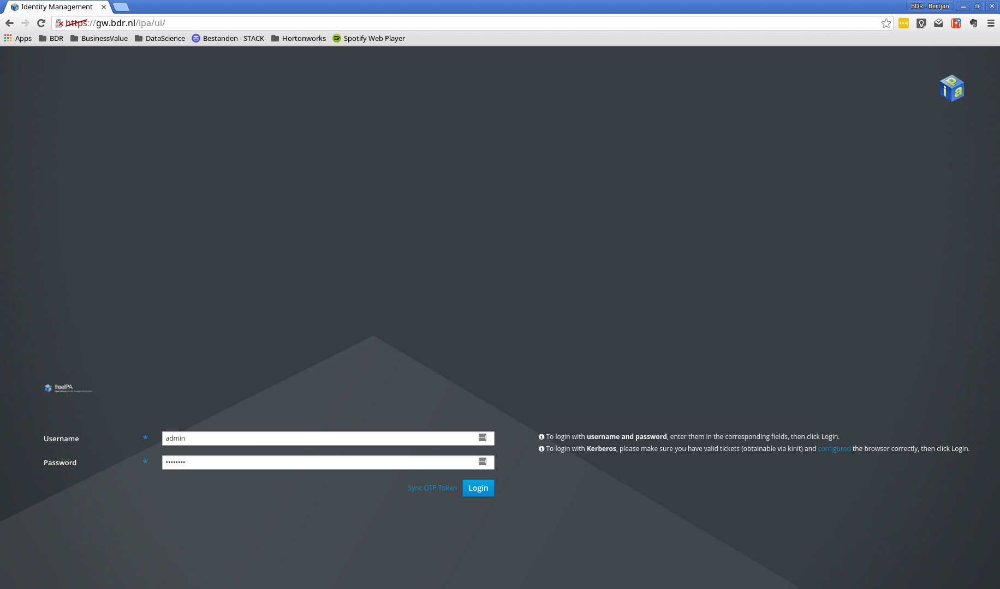
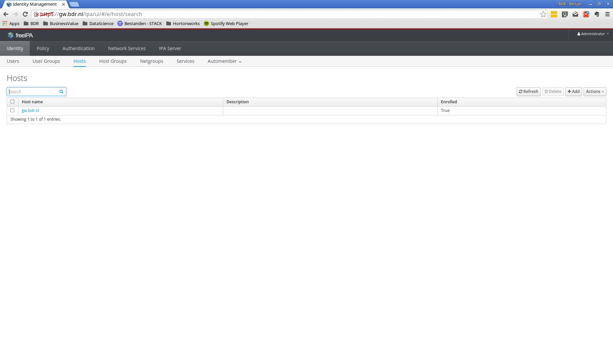
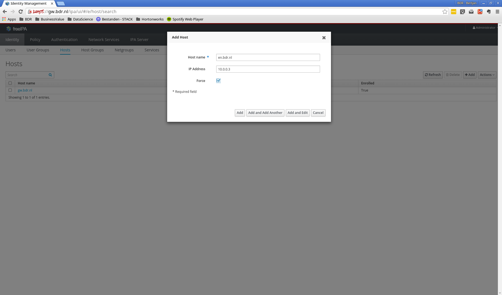
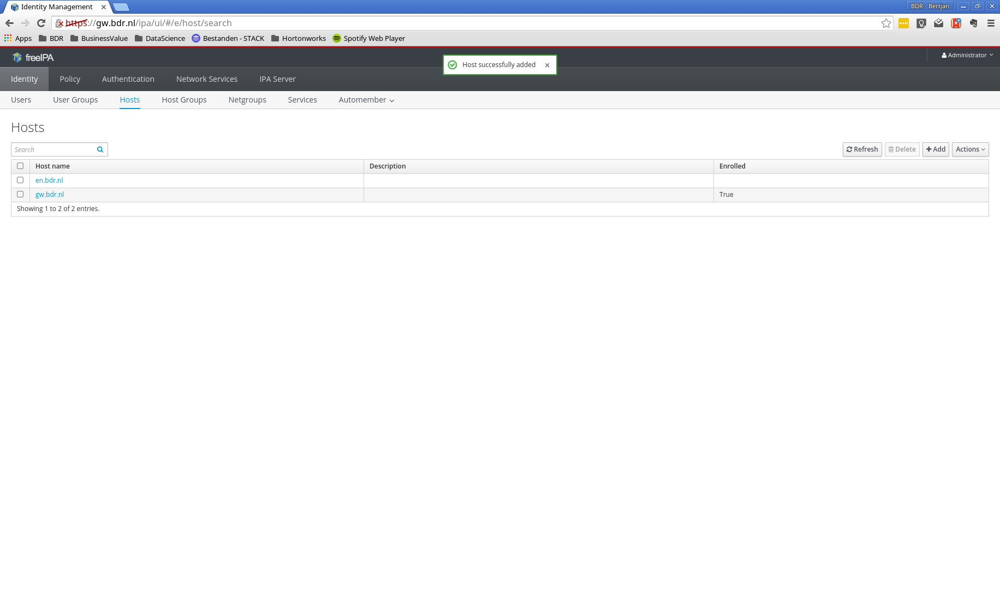
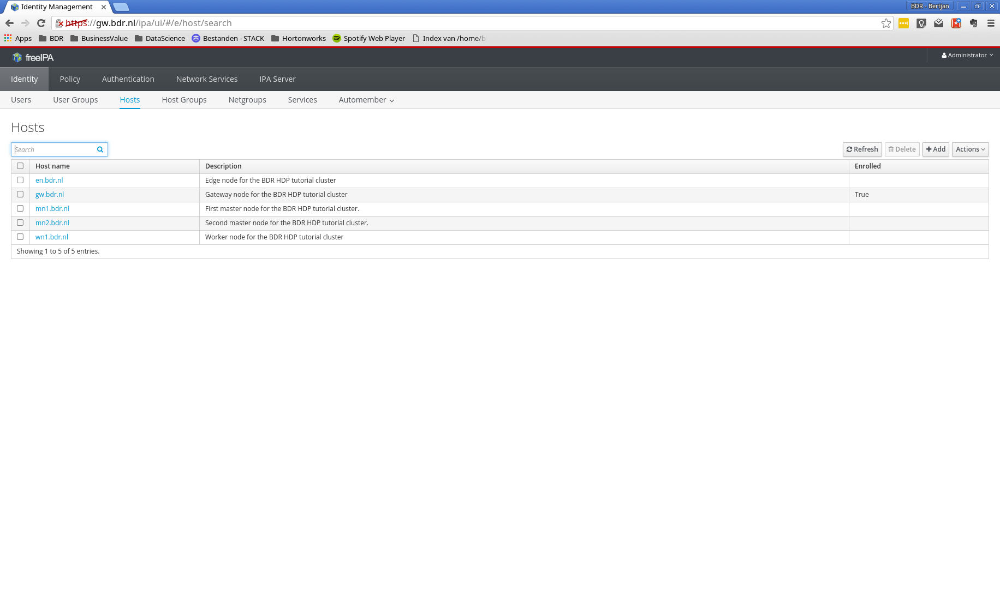
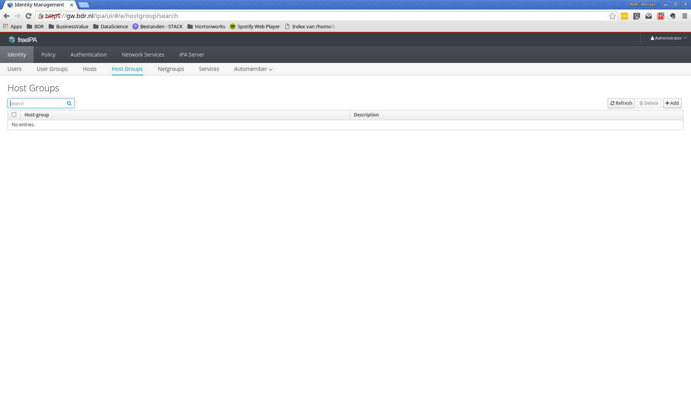
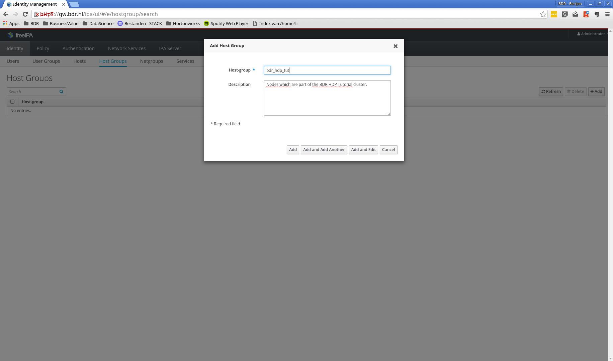
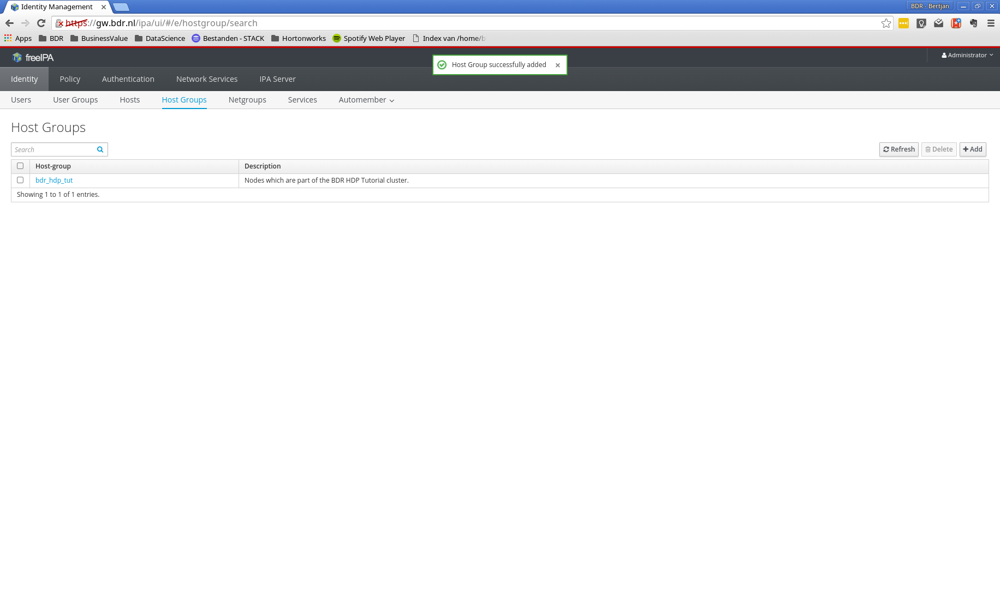
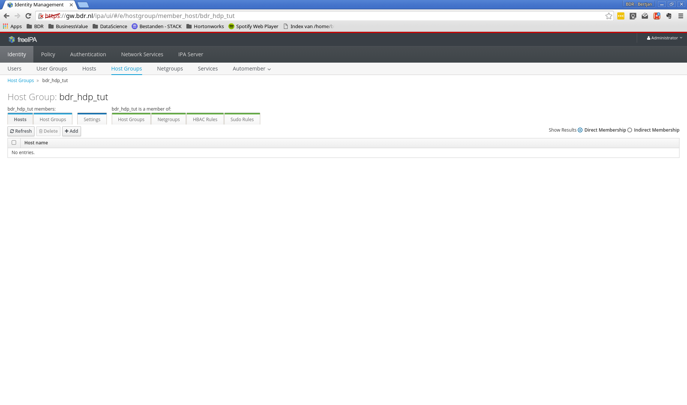

# Free IPA

> FreeIPA is an integrated Identity and Authentication solution for Linux/UNIX networked environments. A FreeIPA server provides centralized authentication, authorization and account information by storing data about user, groups, hosts and other objects necessary to manage the security aspects of a network of computers.
>
> -- <cite>[http://www.freeipa.org/page/about](http://www.freeipa.org/page/about)</cite>

**Goal:** Install and configure a freeipa server. Configure all cluster nodes to retrieve users from the freeipa server in stead of local users.

** Rationale:** Most organizations make use of some kind of enterprise user management system. Microsoft Active Director (AD) is a well known example. To give some hands on experience with enterprise user management we will deviate from the "typical" setup used in HDP tutorials, and setup a FreeIPA server. This server will also serve as LDAP server for the various HDP components which can be connected to LDAP.

## Enter the gateway node

FreeIPA will be installed on the gateway node. Therefore, we'll need to ssh into the proper virtual machine.

```
you@yourhost $ cd /path/to/tutorialdir/vms
you@yourhost $ vagrant up
you@yourhost $ vagrant ssh gw
vagrant@gw.bdr.nl $ sudo su -
root@gw.bdr.nl $
```

## Installation

Speed up the installation process by ensuring enough entropy is available. This is a problem mostly related to VMs. See for more information this [link](https://www.digitalocean.com/community/tutorials/how-to-setup-additional-entropy-for-cloud-servers-using-haveged). For this tutorial it is not important to understand exactly what is going on here.

```
root@gw.bdr.nl $ rpm -Uhv http://mirror.1000mbps.com/epel/7/x86_64/e/epel-release-7-7.noarch.rpm
root@gw.bdr.nl $ yum install haveged
root@gw.bdr.nl $ chkconfig haveged on
root@gw.bdr.nl $ systemctl start haveged
```

Now install the ipa-server and configure it. Irrelevant output is not shown below.

```
root@gw.bdr.nl $ yum install -y ipa-server
root@gw.bdr.nl $ ipa-server-install

Do you want to configure integrated DNS (BIND)? [no]: <enter>
Server host name [gw.bdr.nl]: <enter>
Please confirm the domain name [bdr.nl]: <enter>
Please provide a realm name [BDR.NL]: <enter>
Directory Manager password: bdradmin<enter>
Password (confirm): bdradmin<enter>
IPA admin password: bdradmin<enter>
Password (confirm): bdradmin<enter>

The IPA Master Server will be configured with:
Hostname:       gw.bdr.nl
IP address(es): 10.0.0.2
Domain name:    bdr.nl
Realm name:     BDR.NL

Continue to configure the system with these values? [no]: yes
```

# Configure free ipa

Once ipa is installed, we can navigate to the webui to configure the ipa server. To this end, open a browser and navigate to the gateway node: http://10.0.0.2. This should give you the FreeIPA configuration web interface as shown below. Login with:

* Username: admin
* Password: bdradmin



After login you should see the following main screen.


## Add hosts

Now we need to register all hosts that will part of our cluster in FreeIPA. On the main screen, click on the 'Hosts' tab under 'Identity'.



Next, click the 'add' button to add a new host.



Fill in the details for the Edge node (en.bdr.nl):

* Host name: en.bdr.nl
* IP Address: 10.0.0.3
* Force: yes (tick the box)



Repeat this process for the remaning hosts:

* 10.0.0.4    mn1.bdr.nl
* 10.0.0.5    mn2.bdr.nl
* 10.0.0.6    wn1.bdr.nl

You can eventually eddit host details to add a description. Once all hosts are added, the Hosts section should look like this:



Add this point only one host is enrolled, the others will follow once we add the hosts to our cluster.

# Define a host group

FreeIPA allows you to configure which users have access to which hosts, or group of hosts. We will create a hostgroup for our VMs, as if they where part of a larger network infrastructure. Click on 'Host Groups' under 'Identity'.



Click 'add' to create a new host group and enter the following details:

* Host-group: bdr_hdp_tut
* description: Nodes which are part of the BDR HDP Tutorial cluster.



Click 'add' to create the group.



Click on the newly added host group to add hosts to it.


Click on the 'add' button, select all hosts, click the right arrow, and finally click 'add' in the dialog.




This concludes the initial configuration of FreeIPA. We will come back once we need users for our cluster.
