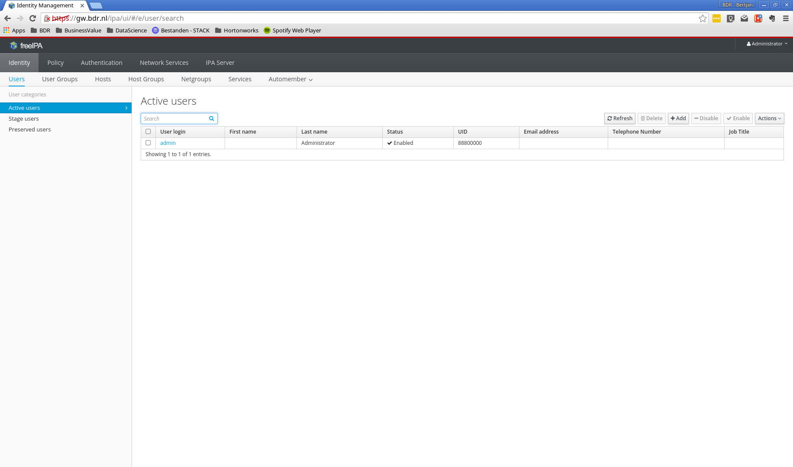

# Free IPA

> FreeIPA is an integrated Identity and Authentication solution for Linux/UNIX networked environments. A FreeIPA server provides centralized authentication, authorization and account information by storing data about user, groups, hosts and other objects necessary to manage the security aspects of a network of computers.
>
> -- <cite>[http://www.freeipa.org/page/about](http://www.freeipa.org/page/about)</cite>

**Goal:** Install and configure a freeipa server. Configure all cluster nodes to retrieve users from the freeipa server in stead of local users.

** Rationale:** Most organizations make use of some kind of enterprise user management system. Microsoft Active Director (AD) is a well known example. To give some hands on experience with enterprise user management we will deviate from the "typical" setup used in HDP tutorials, and setup a FreeIPA server. This server will also serve as LDAP server for the various HDP components which can be connected to LDAP.

## Enter the gateway node

FreeIPA will be installed on the gateway node. Therefore, we'll need to ssh into the proper virtual machine.

```
you@yourhost $ cd /path/to/tutorialdir/vms
you@yourhost $ vagrant up
you@yourhost $ vagrant ssh gw
vagrant@gw.bdr.nl $ sudo su -
root@gw.bdr.nl $
```

## Installation

Speed up the installation process by ensuring enough entropy is available. This is a problem mostly related to VMs. See for more information this [link](https://www.digitalocean.com/community/tutorials/how-to-setup-additional-entropy-for-cloud-servers-using-haveged). For this tutorial it is not important to understand exactly what is going on here.

```
root@gw.bdr.nl $ rpm -Uhv https://dl.fedoraproject.org/pub/epel/epel-release-latest-7.noarch.rpm
root@gw.bdr.nl $ yum install haveged
root@gw.bdr.nl $ systemctl enable haveged
root@gw.bdr.nl $ systemctl start haveged
```

Make sure that the hostname does not resolve to localhost:

```
root@gw.bdr.nl $ vi /etc/hosts
10.0.0.2    gw.bdr.nl sandbox
127.0.0.1   localhost localhost.localdomain localhost4 localhost4.localdomain4
::1         localhost localhost.localdomain localhost6 localhost6.localdomain6
```

Now install the ipa-server and configure it. Irrelevant output is not shown below.

```
root@gw.bdr.nl $ yum install -y ipa-server
root@gw.bdr.nl $ ipa-server-install

Do you want to configure integrated DNS (BIND)? [no]: <enter>
Server host name [gw.bdr.nl]: <enter>
Please confirm the domain name [bdr.nl]: <enter>
Please provide a realm name [BDR.NL]: <enter>
Directory Manager password: bdradmin<enter>
Password (confirm): bdradmin<enter>
IPA admin password: bdradmin<enter>
Password (confirm): bdradmin<enter>

The IPA Master Server will be configured with:
Hostname:       gw.bdr.nl
IP address(es): 10.0.0.2
Domain name:    bdr.nl
Realm name:     BDR.NL

Continue to configure the system with these values? [no]: yes
```

# Configure free ipa

Once ipa is installed, we can navigate to the webui to configure the ipa server. To this end, open a browser and navigate to the gateway node: http://10.0.0.2. This should give you the FreeIPA configuration web interface as shown below. Login with:

* Username: admin
* Password: bdradmin


After login you should see the following main screen.



## Add hosts

Now we need to register all hosts that will part of our cluster in FreeIPA. On the main screen, click on the 'Hosts' tab under 'Identity'.


Next, click the 'add' button to add a new host.


Fill in the details for the Edge node (en.bdr.nl):

* Host name: en.bdr.nl
* IP Address: 10.0.0.3
* Force: yes (tick the box)


Repeat this process for the remaning hosts:

* 10.0.0.4    mn1.bdr.nl
* 10.0.0.5    mn2.bdr.nl
* 10.0.0.6    wn1.bdr.nl

You can eventually eddit host details to add a description. Once all hosts are added, the Hosts section should look like this:


Add this point only one host is enrolled, the others will follow once we add the hosts to our cluster.

# Define a host group

FreeIPA allows you to configure which users have access to which hosts, or group of hosts. We will create a hostgroup for our VMs, as if they where part of a larger network infrastructure. Click on 'Host Groups' under 'Identity'.


Click 'add' to create a new host group and enter the following details:

* Host-group: bdr_hdp_tut
* description: Nodes which are part of the BDR HDP Tutorial cluster.


Click 'add' to create the group.


Click on the newly added host group to add hosts to it.


Click on the 'add' button, select all hosts, click the right arrow, and finally click 'add' in the dialog.


This concludes the initial configuration of FreeIPA. We will come back once we need users for our cluster.


# Register the host to FreeIPA

The first step is to register the host to FreeIPA. We need to install the ipa-client and perform the ipa-client-install as detailed below.

```
root@en.bdr.nl $ yum install -y ipa-client
root@en.bdr.nl $ ipa-client-install
DNS discovery failed to determine your DNS domain
Provide the domain name of your IPA server (ex: example.com): bdr.nl
Provide your IPA server name (ex: ipa.example.com): gw.bdr.nl
The failure to use DNS to find your IPA server indicates that your resolv.conf file is not properly configured.
Autodiscovery of servers for failover cannot work with this configuration.
If you proceed with the installation, services will be configured to always access the discovered server for all operations and will not fail over to other servers in case of failure.
Proceed with fixed values and no DNS discovery? [no]: yes
Client hostname: en.bdr.nl
Realm: BDR.NL
DNS Domain: bdr.nl
IPA Server: gw.bdr.nl
BaseDN: dc=bdr,dc=nl

Continue to configure the system with these values? [no]: yes
Synchronizing time with KDC...
Attempting to sync time using ntpd.  Will timeout after 15 seconds
User authorized to enroll computers: admin
Password for admin@BDR.NL:
Successfully retrieved CA cert
    Subject:     CN=Certificate Authority,O=BDR.NL
    Issuer:      CN=Certificate Authority,O=BDR.NL
    Valid From:  Fri Jul 01 20:15:36 2016 UTC
    Valid Until: Tue Jul 01 20:15:36 2036 UTC

Enrolled in IPA realm BDR.NL
Created /etc/ipa/default.conf
New SSSD config will be created
Configured sudoers in /etc/nsswitch.conf
Configured /etc/sssd/sssd.conf
Configured /etc/krb5.conf for IPA realm BDR.NL
trying https://gw.bdr.nl/ipa/json
Forwarding 'ping' to json server 'https://gw.bdr.nl/ipa/json'
Forwarding 'ca_is_enabled' to json server 'https://gw.bdr.nl/ipa/json'
Systemwide CA database updated.
Added CA certificates to the default NSS database.
Hostname (en.bdr.nl) does not have A/AAAA record.
Failed to update DNS records.
Missing A/AAAA record(s) for host en.bdr.nl: 10.0.0.3.
Missing reverse record(s) for address(es): 10.0.0.3.
Adding SSH public key from /etc/ssh/ssh_host_rsa_key.pub
Adding SSH public key from /etc/ssh/ssh_host_ecdsa_key.pub
Adding SSH public key from /etc/ssh/ssh_host_ed25519_key.pub
Forwarding 'host_mod' to json server 'https://gw.bdr.nl/ipa/json'
Could not update DNS SSHFP records.
SSSD enabled
Configured /etc/openldap/ldap.conf
No SRV records of NTP servers found. IPA server address will be used
NTP enabled
Configured /etc/ssh/ssh_config
Configured /etc/ssh/sshd_config
Configuring bdr.nl as NIS domain.
Client configuration complete.

```

Once the setup is completed, FreeIPA now should mark the Edge Node as enrolled (you might need to refresh the page):


# Create a user for Ambari

By default ambari-server and ambari-agents run as root. This is not best practice so we will create a dedicated user, called ambari, under which these services will run. As we use FreeIPA, we can create the ambari user there, and it will become available on all nodes, once each of them has been enrolled to FreeIPA.

## Create the hadoop users group

The ambari user must be in the hadoop group<sup>[*](https://docs.hortonworks.com/HDPDocuments/Ambari-2.2.1.1/bk_Ambari_Security_Guide/content/_how_to_configure_ambari_server_for_non-root.html)</sup>. Let's add a group hadoop first. Go to the FreeIPA webinterface and click the 'User Groups' tab under 'Identity'.


Click add group to create a new group. The group name **must** be hadoop and the group type **must** be posix, as this group will serve as a linux user group on our cluster nodes.


Click add, and the group should now appear in the group list.


## Create the ambari user


Click add and edit:


Make sure that the following details are correct:


### Settings

* login shell: /bin/bash

### User Groups

* Add the earlier create hadoop group


## Create a sudoers rule

The ambari user relies on sudo to run specific commands that require elevated privileges. Therefore we must create a proper sudo rule for the ambari user ([details](https://docs.hortonworks.com/HDPDocuments/Ambari-2.2.1.1/bk_Ambari_Security_Guide/content/_configuring_ambari_for_non-root.html)).


## Check if everything works

Once you have created the hadoop group, ambari user, and the appropriate sudo configuration, you will restart the sssd service on en.bdr.nl:

```
root@en.bdr.nl $ service sssd restart
root@en.bdr.nl $ sudo su - ambari
# sudo su - ambari
Last login: Fri Jul  1 17:28:55 PDT 2016 on pts/0
su: warning: cannot change directory to /home/ambari: No such file or directory
ambari@en.bdr.nl $
```

The warning can be fixed by creating a home directory for ambari. This is not strictly required, but is done as follows:

```
ambari@en.bdr.nl $ exit
root@en.bdr.nl $ mkdir /home/ambari
root@en.bdr.nl $ chown -R ambari:ambari /home/ambari
root@en.bdr.nl $ sudo - su ambari
Last login: Fri Jul  1 17:34:04 PDT 2016 on pts/0
ambari@en.bdr.nl $
```

Let's check our sudo rights:

```
ambari@en.bdr.nl $ sudo -l
Matching Defaults entries for ambari on this host:
    !visiblepw, always_set_home, env_reset, env_keep="COLORS DISPLAY HOSTNAME HISTSIZE INPUTRC KDEDIR LS_COLORS", env_keep+="MAIL PS1 PS2 QTDIR USERNAME LANG LC_ADDRESS LC_CTYPE", env_keep+="LC_COLLATE LC_IDENTIFICATION
    LC_MEASUREMENT LC_MESSAGES", env_keep+="LC_MONETARY LC_NAME LC_NUMERIC LC_PAPER LC_TELEPHONE", env_keep+="LC_TIME LC_ALL LANGUAGE LINGUAS _XKB_CHARSET XAUTHORITY", secure_path=/sbin\:/bin\:/usr/sbin\:/usr/bin

User ambari may run the following commands on this host:
    (ALL : ALL) NOPASSWD: ALL
ambari@en.bdr.nl $ sudo su -
root@en.bdr.nl $
```
