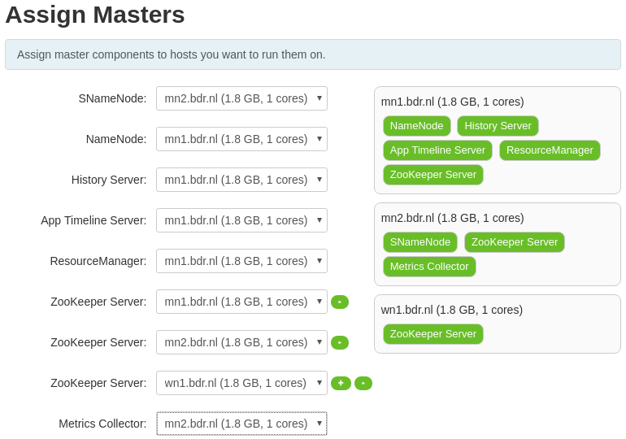

# Steps to install HDP with Ambari

Based on the documentation at http://docs.hortonworks.com/HDPDocuments/Ambari-2.2.1.0/bk_Installing_HDP_AMB/content/index.html.

1. Walk through hdp-ambari-install-checklist.md

1. Connect to `mn1.bdr.nl (10.0.0.2)`

1. Become root

        $ sudo su -

1. Kick off Ambari setup

    ```
    root $ ambari-server setup
    * Customize user account for ambari-server daemon [y/n] (n)? y
      Enter user account for ambari-server daemon (root): ambari
      Adjusting ambari-server permissions and ownership...
      Checking firewall status...
      Checking JDK...
      [1] Oracle JDK 1.8 + Java Cryptography Extension (JCE) Policy Files 8
      [2] Oracle JDK 1.7 + Java Cryptography Extension (JCE) Policy Files 7
      [3] Custom JDK
      ==============================================================================
    * Enter choice (1): 1  
      To download the Oracle JDK and the Java Cryptography Extension (JCE) Policy Files you must accept the license terms found at http://www.oracle.com/technetwork/java/javase/terms/license/index.html and not accepting will cancel the Ambari Server setup and you must install the JDK and JCE files manually.
      Do you accept the Oracle Binary Code License Agreement [y/n] (y)? y
      Downloading JDK from http://public-repo-1.hortonworks.com/ARTIFACTS/jdk-8u60-linux-x64.tar.gz to /var/lib/ambari-server/resources/jdk-8u60-linux-x64.tar.gz
      jdk-8u60-linux-x64.tar.gz... 100% (172.8 MB of 172.8 MB)
      Successfully downloaded JDK distribution to /var/lib/ambari-server/resources/jdk-8u60-linux-x64.tar.gz
      Installing JDK to /usr/jdk64/
      Successfully installed JDK to /usr/jdk64/
      Downloading JCE Policy archive from http://public-repo-1.hortonworks.com/ARTIFACTS/jce_policy-8.zip to /var/lib/ambari-server/resources/jce_policy-8.zip
      Successfully downloaded JCE Policy archive to /var/lib/ambari-server/resources/jce_policy-8.zip
      Installing JCE policy...
      Completing setup...
      Configuring database...
    * Enter advanced database configuration [y/n] (n)? y
      Configuring database...
      ==============================================================================
      Choose one of the following options:
      [1] - PostgreSQL (Embedded)
      [2] - Oracle
      [3] - MySQL
      [4] - PostgreSQL
      [5] - Microsoft SQL Server (Tech Preview)
      [6] - SQL Anywhere
      ==============================================================================
    * Enter choice (1): 4
    * Hostname (localhost): mn1.bdr.nl
    * Port (5432): 5432
    * Database name (ambari): ambaridb
    * Postgres schema (ambari): ambari
    * Username (ambari): ambari
    * Enter Database Password (bigdata): ambari
    * Re-enter password: ambari
      Configuring ambari database...
      Configuring remote database connection properties...
      WARNING: Before starting Ambari Server, you must run the following DDL against the database to create the schema: /var/lib/ambari-server/resources/Ambari-DDL-Postgres-EMBEDDED-CREATE.sql
    * Proceed with configuring remote database connection properties [y/n] (y)? y
      Extracting system views...
      .ambari-admin-2.2.1.0.161.jar
      .....
      Adjusting ambari-server permissions and ownership...
      Ambari Server 'setup' completed successfully.
    ```

1. Start the ambari server

        $ ambari-server start

   if errors occur take a look at the startup log

        $ cat /var/log/ambari-server/ambari-server.out

1. Open the Ambari webinterface in a browser

    http://10.0.0.2:8080

    Login with user: `admin`, password `admin`

1. Launch the install wizzard

    * Give the cluster a name
    * Select the HDP 2.4 stack
    * Enter the list of hosts:

        ```
        mn1.bdr.nl
        mn2.bdr.nl
        wn1.bdr.nl
        wn2.bdr.nl
        ```

    * Copy-paste the private key from mn1.bdr.nl (`cat /root/.ssh/id_rsa`), in the required field
    * Confirm hosts

        If registration fails, check if you can do an ssh, passwordless login,
        to the failing host from the host running ambari server.

        Make sure to resolve all issues that are brought up by the Host checks
        which are performed.

    * We go for a minimal installation, which we will gradually extend. Therefore
      only select the following services:

      * HDFS
      * YARN + MapReduce2
      * ZooKeeper
      * Ambari Metrics

    * Assign masters:

    


    * Assign slaves and clients

    

    * Customize services. For the minimal installation all configuration
      options should have been addressed properly with the recommended defaults.
      The only thing we need to address is the fact that we run ambari-server as
      ambari user and not as root.

      See: https://docs.hortonworks.com/HDPDocuments/Ambari-2.2.1.0/bk_Ambari_Security_Guide/content/_how_to_configure_ambari_server_for_non-root.html

      To this end we need to adapt the HDFS configuration:

      Add the following two properties to *Custom core site* (under *Advanced*):

        ```
        hadoop.proxyuser.ambari.groups=*
        hadoop.proxyuser.ambari.hosts=*
        ```

    * Review the final configuration and start deployment

    If everything went without problems, we have now a minimal HDP which runs:

    * HDFS
    * MapReduce2
    * YARN
    * ZooKeeper

    Monitoring the cluster is enabled by the ambari metrics agents that run on the
    hosts. Before moving on, first check in Ambari that all installed services are
    running as expected. Perform troubleshooting when this is not the case.

1. A first simple test to see if the cluster is up to it's job

    Log into the mgmt1 host with ssh and become the hdfs user.

        $ sudo su - hdfs

    Now write 10MB of random data to the cluster

        $ yarn jar /usr/hdp/current/hadoop-mapreduce-client/hadoop-mapreduce-examples.jar randomwriter -Dtest.randomwrite.total_bytes=10240 test-after-upgrade

   When things don't go as expected start troubleshooting the issue. Check in
   Ambari the status and configuration of Yarn and HDFS. When HDFS is starting to
   fill up these are some useful commands (run on mn1.bdr.nl):

   Become the hdfs user
   ```
   $ su - hdfs
   # Find large files / directories in HDFS
   $ hdfs fsck / -files | grep -v "<dir>" | gawk '{print $2, $1;}'  | sort -n
   # Permanantly remove files no longer needed.
   $ hdfs dfs -rm -r -f -skipTrash /user/hdfs/test-after-upgrade/
   ```
