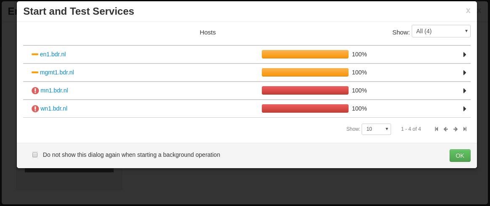

# Configure Ambari and Hadoop for Kerberos

For complete documentation on Kerberizing an Ambari managed cluster take a look
[here](https://docs.hortonworks.com/HDPDocuments/Ambari-2.2.1.1/bk_Ambari_Security_Guide/content/_kerberos_overview.html)

1. Go to the Ambari web interface

    * Admin -> Kerberos
    * Click 'Enable Kerberos'

1. Kerberos wizard - Get started

   

1. Kerberos wizard - Configure kerberos

    

1. Kerberos wizard - Configure Identities

   * Remove clustername from smoke/hdfs principals to remove the -${cluster_name} references to look like below

   

1. Kerberos wizard - Confirm Configuration

   Download csv file but **DO NOT** click Next yet

   

# Configure hosts


1. Copy the kerberos csv file to the ipa host

1. Login on the ipa host
```
  $ vagrant ssh ipa.bdr.nl
  vagrant@ipa $ sudo su -
  root@ipa $
```

1. On the ipa host, create principals, using the csv file.
```
  root@ipa $ awk -F"," '/SERVICE/ {print "ipa service-add --force "$3}' kerberos.csv | sort -u > ipa-add-spn.sh
  root@ipa $ awk -F"," '/USER/ {print "ipa user-add "$5" --first="$5" --last=Hadoop --shell=/sbin/nologin"}' kerberos.csv | sort -u > ipa-add-upn.sh

  root@ipa $ sh ipa-add-spn.sh
  root@ipa $ sh ipa-add-upn.sh
```

## Create keytabs on nodes (mgmt1, en1, mn1, wn1)

First you have to retrieve an kerberos ticket.

```
root@mgmt1 $ kinit admin
```
Next, retrieve keytabs for users/services on this host from the ipa server.
```
root@mgmt1 $ ipa_server=$(cat /etc/ipa/default.conf | awk '/^server =/ {print $3}')
root@mgmt1 $ mkdir /etc/security/keytabs/
root@mgmt1 $ chown root:hadoop /etc/security/keytabs/
root@mgmt1 $ awk -F"," '/'$(hostname -f)'/ {print "ipa-getkeytab -s '${ipa_server}' -p "$3" -k "$6";chown "$7":"$9,$6";chmod "$11,$6}' kerberos.csv | sort -u > gen_keytabs.sh
root@mgmt1 $ sh gen_keytabs.sh
```
Make sure that keytabs were generated succesfully (**NOTE:** adjust lines below
to reflect users and/or services that actually run on the host):
```
root@mgmt1 $ sudo -u ambari-qa kinit -kt /etc/security/keytabs/smokeuser.headless.keytab ambari-qa@BDR.NL
root@mgmt1 $ sudo -u hdfs kinit -kt /etc/security/keytabs/hdfs.headless.keytab hdfs@BDR.NL
```

**NOTE:** Repeat above process for *all* nodes part of your cluster.

# Continue Ambari Kerberos wizard

1. Kerberos wizard - Stop Services

   

1. Kerberos wizard - Kerberize Cluster

  

1. Kerberos wizard - Start and Test Services

  


# Kerberos quick guide

* Init as user with password
```
root@ipa $ kinit admin
Password for admin@BDR.NL: bdr-ipa-admin<enter>
```

* Generate a keytab for a given user (e.g. hdfs)
```
root@ipa $ kinit admin
root@ipa $ kadmin.local -q "xst -k hdfs.keytab hdfs"
 # You'll now have /root/hdfs.keytab
 # We can copy this file to any other host in the cluster (e.g. mm1)
root@ipa $ scp /root/hdfs.keytab vagrant@mn1.bdr.nl:/home/vagrant/hdfs.headless.keytab
```

* Init as a user with a keytab
```
kinit -kt /etc/security/keytabs/smokeuser.headless.keytab ambari-qa@BDR.NL
```

* Unlock a locked user account
Lets assume that the hdfs user is blocked
```
root@ipa $ kinit admin
root@ipa $ kadmin.local
```
First we retrieve the user to inspect its current state
```
kadmin.local: getprinc hdfs
Principal: hdfs@BDR.NL
Expiration date: [never]
Last password change: Wed May 11 15:21:12 CEST 2016
Password expiration date: [none]
Maximum ticket life: 1 day 00:00:00
Maximum renewable life: 7 days 00:00:00
Last modified: Wed May 11 15:47:07 CEST 2016 (admin@BDR.NL)
Last successful authentication: Wed May 11 15:50:47 CEST 2016
Last failed authentication: Wed May 11 15:50:47 CEST 2016
Failed password attempts: 1
Number of keys: 4
Key: vno 3, aes256-cts-hmac-sha1-96, no salt
Key: vno 3, aes128-cts-hmac-sha1-96, no salt
Key: vno 3, des3-cbc-sha1, no salt
Key: vno 3, arcfour-hmac, no salt
MKey: vno 1
Attributes: REQUIRES_PRE_AUTH
Policy: [none]
```
Next we unlock this user as follows:
```
kadmin.local: modprinc -unlock hdfs
```

# Troubleshooting

http://hortonworks.com/wp-content/uploads/2014/10/Security-workshop-HDP-2_1-script.txt

When things do not go as expected look at the error messages to get some hints
on what problem needs to be solved:


Click on the "Start and test services" link.



Chose a node which did not start correctly. E.g. mn1.bdr.nl:


Chose the service that failed to start. E.g. Namenode start:


The full text of the error message in this case is:

```
Traceback (most recent call last):
  File "/var/lib/ambari-agent/cache/common-services/HDFS/2.1.0.2.0/package/scripts/namenode.py", line 401, in <module>
    NameNode().execute()
  File "/usr/lib/python2.6/site-packages/resource_management/libraries/script/script.py", line 219, in execute
    method(env)
  File "/var/lib/ambari-agent/cache/common-services/HDFS/2.1.0.2.0/package/scripts/namenode.py", line 102, in start
    namenode(action="start", hdfs_binary=hdfs_binary, upgrade_type=upgrade_type, env=env)
  File "/usr/lib/python2.6/site-packages/ambari_commons/os_family_impl.py", line 89, in thunk
    return fn(*args, **kwargs)
  File "/var/lib/ambari-agent/cache/common-services/HDFS/2.1.0.2.0/package/scripts/hdfs_namenode.py", line 151, in namenode
    user = params.hdfs_user)
  File "/usr/lib/python2.6/site-packages/resource_management/core/base.py", line 154, in __init__
    self.env.run()
  File "/usr/lib/python2.6/site-packages/resource_management/core/environment.py", line 158, in run
    self.run_action(resource, action)
  File "/usr/lib/python2.6/site-packages/resource_management/core/environment.py", line 121, in run_action
    provider_action()
  File "/usr/lib/python2.6/site-packages/resource_management/core/providers/system.py", line 238, in action_run
    tries=self.resource.tries, try_sleep=self.resource.try_sleep)
  File "/usr/lib/python2.6/site-packages/resource_management/core/shell.py", line 70, in inner
    result = function(command, **kwargs)
  File "/usr/lib/python2.6/site-packages/resource_management/core/shell.py", line 92, in checked_call
    tries=tries, try_sleep=try_sleep)
  File "/usr/lib/python2.6/site-packages/resource_management/core/shell.py", line 140, in _call_wrapper
    result = _call(command, **kwargs_copy)
  File "/usr/lib/python2.6/site-packages/resource_management/core/shell.py", line 291, in _call
    raise Fail(err_msg)
resource_management.core.exceptions.Fail: Execution of '/usr/bin/kinit -kt /etc/security/keytabs/hdfs.headless.keytab hdfs@BDR.NL' returned 1. kinit: Clients credentials have been revoked while getting initial credentials
```

We find the cause to be that, on mn1.bdr.nl the following command does not give
the desired result:

```
root@mn1 $ /usr/bin/kinit -kt /etc/security/keytabs/hdfs.headless.keytab hdfs@BDR.NL
kinit: Password incorrect while getting initial credentials
```

And after a couple of attempts:

```
root@mn1 $ /usr/bin/kinit -kt /etc/security/keytabs/hdfs.headless.keytab hdfs@BDR.NL
kinit: Clients credentials have been revoked while getting initial credentials
```

Let's analyze the kerberos.csv file to get see what's going on. Opening the
file in Excel and sorting on principal type we find:


One thing we notice is that the principal name is the same, even when the host
differs. What happens is that first one node retrieves a keytab for the
ambari-qa principal, let's say en1. Next, the following node retrieves a keytab
for the same principal on mgmt1. This depends on the order in which you
performed the keytab import steps. Once a node retrieves a keytab for a
particular principal, it renders the keytab for the same principal on the other
nodes invalid.

What we want to solve this problem is principal names which includes the
hostname:

```
en1/hdfs@BDR.NL
```
as principal name for hdfs@BDR.NL on en1, in stead of:

```
hdfs@BDR.NL
```

To solve this issue, perform the following steps.

* Donwload all keytabs to one machine.
* Copy those keytab files to all other machines that need the same account
